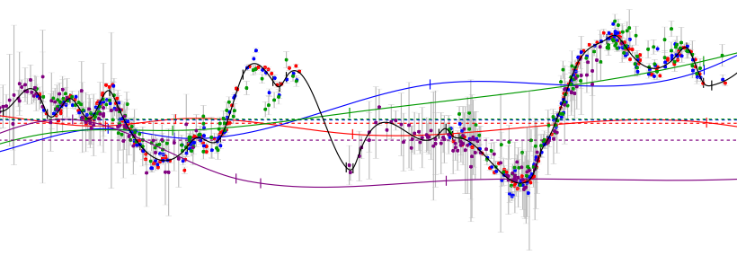

PyCS : Python Curve Shifting
============================

About
-----

PyCS is a software toolbox to estimate time delays between multiple images of strongly lensed quasars, from resolved light curves such as obtained by the `COSMOGRAIL <http://www.cosmograil.org/>`_ monitoring program. The methods implemented in PyCS are described in our paper `COSMOGRAIL XI: Techniques for time delay measurement in presence of microlensing (Tewes et al. 2013) <http://arxiv.org/abs/1208.5598>`_.

PyCS is not a standalone program; it comes in the form of a python package called ``pycs``, and heavily depends on ``numpy``, ``scipy``, and ``matplotlib``. The ``pycs`` package defines a collection of classes and high level functions, that you can *script* in a flexible way. PyCS makes it easy to compare different point estimators (including your own) without much code integration.

If you have already read our paper, you might want to proceed with :doc:`installation`, or the :doc:`tutorial/tutorial`. To get a **quick first impression** of how PyCS looks in practice, install PyCS and then go directly to the :doc:`tutorial/demo1`. These show you how to **reproduce** the figures from the methods paper.

.. warning:: The paper is out (A&A 553 A120, June 2013), and version 1.0 of the code is now available. The :doc:`tutorial/demo1` are up to date and compatible with this latest version. However parts of the :doc:`tutorial/tutorial` (from Section 6 on) are currently outdated and does not reflect the code. I'm working on this right now.

Last build of this documentation : |today|.

Questions / Feedback
--------------------

Don't hesitate to contact us, via email at ``mtewes at astro dot uni-bonn dot de`` !

.. note:: This documentation is currently rewritten using Sphinx. 
	There might still be badly formatted content, especially in the autogenerated API documentation.

Contents
--------

.. toctree::
	:maxdepth: 2
	
	installation
	tutorial/tutorial
	Autogenerated Full API <apidoc/pycs>
	todo
	howtodoc
	
   
