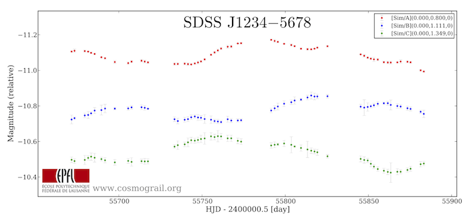
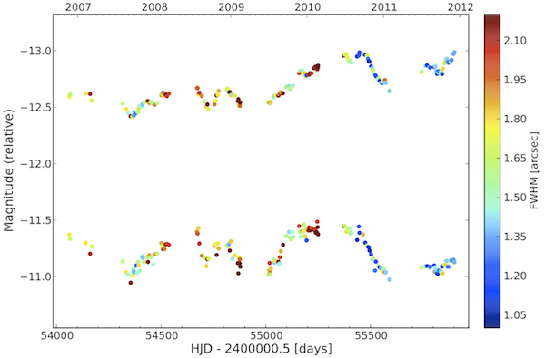
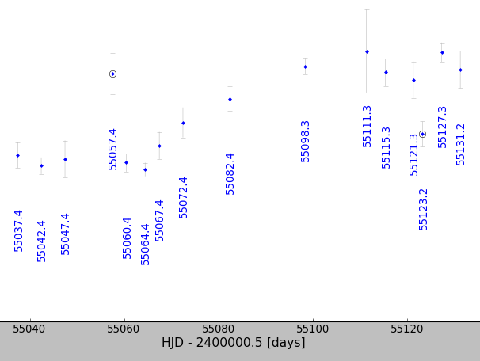

The lightcurve object
=====================

The module :py:mod:`pycs.gen.lc` defines the class :py:class:`~pycs.gen.lc.lightcurve` that constitutes the backbone of pycs.
First step is to learn about this fundamental object, and the functions to manipulate lightcurve instances.

Importing lightcurves
---------------------

You probably have some light curves in the form of simple text/csv/rdb files. If not, get the trial curves from :doc:`demo1`.

Importing from cosmouline/lcmanip or similar rdb files
""""""""""""""""""""""""""""""""""""""""""""""""""""""

Cosmouline and lcmanip write their lightcurves as rdb files (i.e., lots of tab-separated collumns, and a short header).
By *importing* such data into pycs, I mean *reading such rdb files* and turning them into the mentionned lightcurve objects.
Here are some lines of a cosmouline/lcmanip output file (for a double lens) :

::

	mhjd	datetime	telescope	setname	nbimg	fwhm	ellipticity	airmass	relskylevel	normcoeff	flag	mag_A	magerr_A_1	magerr_A_2	magerr_A_3	magerr_A_4	mag_B	magerr_B_1	magerr_B_2	magerr_B_3	magerr_B_4
	====	========	=========	=======	=====	====	===========	=======	===========	=========	====	=====	==========	==========	==========	==========	=====	==========	==========	==========	==========
	54061.171611	2006-11-22T04:07:07	EulerC2	1	5	1.782	0.236	1.081	 507.4	1.018	True	-12.594276	0.0041	0.0100	0.0376	0.0174	-11.372701	0.0093	0.0130	0.0897	0.0266
	54065.165098	2006-11-26T03:57:44	EulerC2	1	5	1.637	0.207	1.086	 363.0	0.830	True	-12.613698	0.0040	0.0111	0.0210	0.0066	-11.333895	0.0092	0.0139	0.0706	0.0130
	54140.086307	2007-02-09T02:04:17	EulerC2	1	5	1.792	0.116	1.882	 558.4	0.873	True	-12.623750	0.0042	0.0073	0.0220	0.0056	-11.298380	0.0109	0.0124	0.1088	0.0387
	54161.021235	2007-03-02T00:30:35	EulerC2	1	4	2.117	0.077	1.792	2845.2	0.863	True	-12.617584	0.0075	0.0112	0.0210	0.0062	-11.202763	0.0254	0.0267	0.1433	0.0747
	54169.004465	2007-03-10T00:06:26	EulerC2	1	2	1.701	0.197	1.879	2147.2	0.868	False	-12.560599	0.0059	0.0064	0.0708	0.0259	-11.266728	0.0169	0.0171	0.2567	0.0902
	54316.327864	2007-08-04T07:52:07	EulerC2	1	5	1.600	0.186	1.405	1637.6	1.242	True	-12.533420	0.0052	0.0224	0.0518	0.0229	-11.134323	0.0153	0.0266	0.0779	0.0435

Let's assume we have such an rdb file called "Mercator.rdb", made with lcmanip, and containing data from a quad, i.e., 4 images : A, B, C and D.
This will give us 4 lightcurve objects; here is how :

::

	filename = "data/Mercator.rdb"
	lcs = [
		pycs.gen.lc.rdbimport(filename, object="A", magcolname="mag_A", magerrcolname="magerr_A_4", telescopename="Mercator", plotcolour="red", mhjdcolname="mhjd", flagcolname = "flag", propertycolnames = ["fwhm", "ellipticity", "airmass", "relskylevel", "normcoeff"], verbose = True),
		pycs.gen.lc.rdbimport(filename, object="B", magcolname="mag_B", magerrcolname="magerr_B_4", telescopename="Mercator", plotcolour="red", mhjdcolname="mhjd", flagcolname = "flag", propertycolnames = ["fwhm", "ellipticity", "airmass", "relskylevel", "normcoeff"], verbose = True),
		pycs.gen.lc.rdbimport(filename, object="C", magcolname="mag_C", magerrcolname="magerr_C_4", telescopename="Mercator", plotcolour="red", mhjdcolname="mhjd", flagcolname = "flag", propertycolnames = ["fwhm", "ellipticity", "airmass", "relskylevel", "normcoeff"], verbose = True),
		pycs.gen.lc.rdbimport(filename, object="D", magcolname="mag_D", magerrcolname="magerr_D_4", telescopename="Mercator", plotcolour="red", mhjdcolname="mhjd", flagcolname = "flag", propertycolnames = ["fwhm", "ellipticity", "airmass", "relskylevel", "normcoeff"], verbose = True)
	]
	

So this uses the function :py:func:`pycs.gen.lc.rdbimport` (click on such links to jump to detailed documentation of the function).
In the example above I've put all the options to illustrate them. Not all these options are required !
The option ``propertycolnames`` allows to read in extra columns of data, that can for instance be used to make colour-coded plots, or custom stuff.
If you omit this option, the function will by default import all the fields specified in the above example, if these are available in the rdb file. 
Note that you are free to choose whatever "object" or "telescopename" you want, these attributes are not related to the content of the rdb file.

Here is a more concise example that you could use as "default" to import lightcurves from lcmanip:

::
	
	mercatorlcs = [pycs.gen.lc.rdbimport("data/2013-04-02_config_J1001_mercator_lcmanip.rdb", 
		magcolname="mag_%s"%e, magerrcolname="magerr_%s_5"%e, flagcolname = "flag",
		telescopename="Mercator", object=e, plotcolour="blue") for e in ["A", "B"]]

A note about object instance names
""""""""""""""""""""""""""""""""""

In the following tutorial (and in the code, actually), I often use the short name ``l`` to designate a given lightcurve object. If we have several lightcurve objects in play, and if we need to give them explicit names for the purpose of the tutorial, we will often call them ``lca``, ``lcb``, ... as they typically represent curves from QSO image A, image B, etc.
A list of lightcurves (as we have just imported above) is usually named ``lcs``. It will be very common to do manipulations like ::

	for l in lcs:
		l.do_something()
		

.. warning:: Note that if possible you should **avoid** to give explicit names to your lightcurve variables  (like ``lca``, ``lcb``) and refer to them using such names all across your code. That's what lists are for ! Just read on :-)

Importing from simple tab-separated files
"""""""""""""""""""""""""""""""""""""""""

The function :py:func:`pycs.gen.lc.flexibleimport` does essentially the same as :py:func:`pycs.gen.lc.rdbimport`, but for simpler input files that do not have headers :

::
	
	l = pycs.gen.lc.flexibleimport("curve.dat", jdcol=1, magcol=2, errcol=3, startline=1,
		telescopename="Unknown", object="Unknown", plotcolour="red", verbose = True)
	

The shown arguments values are the defaults.

Set some plotcolour !
"""""""""""""""""""""

After such an import, and before plotting the curves to see if it went well, you might want to

::
	
	pycs.gen.mrg.colourise(lcs)
	
	
them. This function sets the attribute ``plotcolour`` of each lightcurve to a different colour.
It is important to understand that you can do such operations by hand at any time :

::
	
	l.plotcolour = "brown"

Colours are simply matplotlib colours, so you can use whatever matplotlib accepts.

Plotting lightcurves
--------------------

It's time to see these colours.
Many functions of pycs work with lists of lightcurves, instead of individual lightcurves. These lists usually contain simply one curve for every QSO image. But be aware that all this works in the same way if you use lists that contain curves from different telescopes, or "identical" curves with different settings, or simulated curves, etc.

As mentionned, in the tutorials we will usually call such lists ``lcs``; *s* is a plural s.
The single most important function that uses such a list of curves as argument is the function that displays them :

::

	lcs = [lca, lcb, lcc, lcd] # So that's a list 

	pycs.gen.lc.display(lcs)
	

This function has lots of options, it can be used for many tasks. As we will see in this tutorial, the same function is used to plot microlensing, splines, etc. Here is a link to the full documentation for this function: :py:func:`pycs.gen.lc.display` (have a look).
For now, just as an example, try these options ::

	pycs.gen.lc.display(lcs, title=r"$\mathrm{SDSS\,J1234-5678}$", nicefont=True, showlogo=True)
	# The option nicefont is your friend if you like serif fonts
	# (I don't, except for the title in LaTeX which is always in serif)

And another example:
::

	pycs.gen.lc.display(lcs, showdates=True, colourprop=["fwhm", "FWHM [arcsec]", 1.0, 2.2])
	# For this to work, your points must have the property "fwhm", which should be the
	# case if they come from cosmouline/lcmanip, and if you imported these properties.

Manually shifting lightcurves in time, magnitude, and flux
----------------------------------------------------------

We have 3 elementary methods to do this :

* :py:meth:`pycs.gen.lc.lightcurve.shifttime`
* :py:meth:`pycs.gen.lc.lightcurve.shiftmag`
* :py:meth:`pycs.gen.lc.lightcurve.shiftflux`

::
	
	l.shiftime(5.0) # Shifts the curve by +5 days with respect to its current shift.
	l.shiftmag(-0.2) # Shifts the curve by -0.2 mags (i.e., it gets brighter) with respect to its current shift.
	
	l.shiftflux(2000.0) # "Shifts" the curve by +2000.0 electrons with respect to its current shift.
	# Note that on a magnitude plot, that's actually not a shift, it deforms the curve !

A lightcurve object is always "aware" of its shifts. These shifts don't get *applied* to the data (as long as you don't ask for it). They just set attributes of the lightcurve, telling them by how much they are shifted. The actual data is not modified. It is also perfectly ok to directly tweak the attributes :

::
	
	l.timeshift = 0.0 # "Resets" the curve
	

In a nutshell, we could now see a curve shifting method as a python function that sets these shifts for you, so to minimize a given criteria (for instance a dispersion measure) between curves. More on this later.

Displaying info about lightcurves
---------------------------------

::
	
	print l # Short oneliner; corresponds to str(l), that is also used in plot legends, etc. 

The ouput might come with a paranthesis containing 3 numbers, like for instance ``[Mercator/A](10.000,-0.500,1200)``. This would mean that the curve is shifted by 10 days in time, -0.5 mag in magnitude, and 1200 counts in flux.

::
	
	print l.longinfo()

Gives you a wider picture. Try it !

To display time delays between some curves, try this :

::
	
	print pycs.gen.lc.getnicetimedelays(lcs, separator = " | ")
	print pycs.gen.lc.getnicetimedelays(lcs, separator = " | ", sorted = True) # Sorts according to object names
	

About "properties"
------------------

You saw how to import them, you saw how to use them in plots. 
Properties are very flexible. You can access/modify them from within your scripts, to store just about anything you want.
Properties are stored as entries of dictionnaries in a list as long as your curve (i.e., one dict per data point).

::
	
	print l.properties   # That's a long list of dicts.
	
	l.properties[0]["fwhm"] = "10.0"   # Tweak fwhm of first point
	
	for point in lcs.properties:
		point["w"] =  ... # Add your own properties !

.. note:: To keep all the import/export functionality, store your custom properties as strings. Indeed all the stuff like "fwhm" and "ellipticity" is stored as strings as well.

.. warning:: Some functions of ``pycs`` might get significantly slower when you use properties. For instance stuff that requires merging of curves.

Cutting seasons
---------------

The module :py:mod:`pycs.gen.sea` contains a class and functions to handle seasons.
You can define seasons "by hand", but usually for cosmograil curves the default automatic season detection is fine.

The concept of seaons can be important when defining microlensing representations.
Seasons are also handy to cut curves. There is a very easy function to do just this. In the following example we want to keep only the first and second seasons of some long lightcurves. 

::

	lcs = [lca, lcb] # That's a list of long lightcurves...
	pycs.gen.lc.display(lcs)
	
	pycs.gen.sea.easycut(lcs, keep=(1, 2))
	
	# Each lightcurve is processed individually. Check your results :

	pycs.gen.lc.display(lcs)
	

If you are not happy with how the seasons where identified, try to add the option ``seasongap = 100`` to your call of :py:func:`pycs.gen.sea.easycut`.
This is the number of days without points that start a new season. Default is 60.

Copying lightcurves
-------------------

... can be useful for instance to try out or compare things, and is very easy :

::

	testl = l.copy() # Makes a full deep copy of the entire lightcurve objects, with all properties, labels, mask, etc.
	
	testl.plotcolour = "blue"
	testl.shiftflux(5000)
	
	pycs.gen.lc.display([l, testl])
	

Masking points
--------------

Each lightcurve object has a mask. This is simply a boolean numpy array of the same length as the curve. That's convenient, as such boolen arrays can be used to index normal numpy arrays. In the mask array, ``True`` means that the point is ok, ``False`` means that the point is masked.
Some demo of the flexibility :

::

	l.mask[17] = False # Manual way of masking a point
	l.mask[17:22] = False # Yes, it's a numpy array after all
	
	print l.jds[l.mask] # This gives you only the non-masked raw jds
 
 	l.mask = l.magerrs < 0.1 # Sets the mask to be False for all points with large errorbars.
	# Note that this would also set the mask of all other points to True.
	
.. note:: Masked points are shown with black circles on plots.

Some methods of lightcurve objects related to masks :

* :py:meth:`pycs.gen.lc.lightcurve.hasmask`
* :py:meth:`pycs.gen.lc.lightcurve.clearmask`
* :py:meth:`pycs.gen.lc.lightcurve.cutmask`
* :py:meth:`pycs.gen.lc.lightcurve.maskskiplist`
* :py:meth:`pycs.gen.lc.lightcurve.maskinfo`

Buiding a mask "by hand"
""""""""""""""""""""""""

The best way to do this is to write a "skiplist" of the dates that you want to mask (this is much better than just specifying array indexes, as your skiplist will stay valid even if you merge/cut/tweak your curves). To help you writing such a list, use the function :py:func:`pycs.gen.lc.setjdlabels`. What are lables ? Labels are a bit like properties (see below), you can use them to attach any string to data points, and show them on plots. This particular functions puts the observation epochs as label to each point. 
::

	for l in lcs:
		l.setjdlabels() # Sets the approximate epoch as label of each point.
		l.showlabels = True # Show the labels on plots
	pycs.gen.lc.display(lcs)

The resulting plot will look like this (note that some points are already masked here) :

Now you can write your skiplist; it's just a plain textfile with one line per data point to mask.
Any text following the MHJD is considered as a comment. One decimal is sufficient.
::

	# Some comment
	55111.3		Bad night

To apply this list to mask points of a curve, use the method :py:meth:`pycs.gen.lc.lightcurve.maskskiplist` (click for details).
Of course you can use one file to set the same mask on A and B, or define separate masks.
::
	
	#l.clearmask() # Maybe you want to clear the mask first ?
	l.maskskiplist("myskiplist.txt")

This will mask the point within 0.2 days of the dates specified in the skiplist. You will be warned if there's anything fishy (like two separate points within 0.2 days or so).

Once you are happy with your masking, you could :
::
	
	for l in lcs:
		l.cutmask() # Removes all the masked points from your curve.
		l.clearlabels()
		l.showlabels = False

.. note:: It's a good idea to use cutmask to get "definitively" rid of points that you don't want to use *before* feeding the curves into a curve shifting algorithm. Some curve shifting methods might not accept curves with masked points.

Merging lightcurves
-------------------

When you import lightcurves from several telescopes, you might want to *merge* them, i.e. transform them into one single lightcurve object per quasar image. For instance to pass the resulting merged curves to some curve shifting algorithms.

.. note:: The operation described here is about merging any two lightcurve objects *as they are*. It does not involve optimizing any shifts between the curves so that they *match*. This is described later, in section :ref:`matchtels`. For now let's assume that you have for instance shifted your curves by hand (in magnitude and flux, not in time, usually...) so that they match.

There is a low-level method to merge one lightcurve into another one : :py:meth:`pycs.gen.lc.lightcurve.merge` :
::

	# l and otherl are 2 lightcurve objects.
	
	otherl.shiftmag(0.23)
	
	pycs.gen.lc.display([l, otherl])
	
	l.merge(otherl)
	
	print l.longinfo()
	
	pycs.gen.lc.display([l])
	

.. note:: Any lightcurve, at any time, has to be sorted according to its mhjds. We require that the jds
	are either increasing or (flat). This method thus takes care of this sorting ! Furthermore the properties, masks, labels etc are merged as well, as expected.

.. warning:: Any shifts of ``l`` or ``otherl`` will be *applied* to the data arrays, i.e. the resulting curve is no longer aware of previous shifts.

Often we want to merge a *list* of lightcurve from telescope 1 with a corresponding list of curves from telescope 2 and so on. :py:func:`pycs.gen.mrg.merge` is a wrapper to do exactly this.
::
	
	# You have imported two lists of lightcurves : eulerlcs and mercatorlcs
	# Both lists contain n corresponding lightcurve objects, in the same order (image A, B, C and D).
	
	lcs = pycs.gen.mrg.merge([eulerlcs, mercatorlcs])

Writing and reading  pickles
----------------------------

You will do this all the time, mostly with lightcurve objects. It allows to split up your workflow into different parts, making it a lot more effective and user-friendly. For instance, a first script imports your curves from various sources, masks some outliers and merges telescopes (i.e. all the stuff seen so far in this tutorial), and other scripts use these processed curves to measure the time delays. Writing and reading pickles is **the** easy-to-use connection between these scripts.

::
	
	# Say you have some lightcurves (perhaps just imported, or already heavily processed) :
	lcs = [lca, lcb, lcc, lcd]
	
	pycs.gen.util.writepickle(lcs, "data/lcs_v2_merged.pkl") # Choose your own file name ...
	
	# And "later", in the next script :
	lcs = pycs.gen.util.readpickle("data/lcs_v2_merged.pkl")

If you don't like these "``lcs``" lists, you are free to use other "containers" of your choice, like for instance dicts. Or just directly store one single lightcurve object into your pkl file.
You can of course also store other stuff using these same functions. If working with splines, this is typical (as we will see later in the tutorial) :

::
	
	pycs.gen.util.writepickle((lcs, spline), "opt_test4.pkl")

	# And later ...
	
	(lcs, spline) = pycs.gen.util.readpickle("opt_test4.pkl")

.. note:: Avoid relying on such pickle files to store actual data for eternity. Indeed the definitions of e.g. the lightcurve class might change, and this would make your pickles incompatible.

Writing lightcurves into rdb/ascii files
----------------------------------------

We come to the last point of this first chapter : what to do if your colleague doesn't accept pickle files ?
It is easy to write lightcurve objects into plain rdb files, using :py:meth:`pycs.gen.lc.lightcurve.rdbexport` (click for details). This method nicely works together with :py:func:`pycs.gen.lc.rdbimport`, in the sense that "written" lightcurves can then be "read" again :
::
	
	l.rdbexport(filename="test.txt", properties=["fwhm", "ellipticity"]) # l is a lightcurve object.
	
	imported_l = pycs.gen.lc.rdbimport(filepath="test.txt", telescopename="Test", object="A", plotcolour="blue")

	pycs.gen.lc.display([l, imported_l])

Both of these functions can handle properties. If you want to store properties in your exported file, you will have to specify them as optional arguments, as shown.
To see what properties are available, remember that you can use
::
	
	print l.longinfo()
	

.. note:: As suggested by these functions, you should always write one file per lightcurve, when working with pycs. This is indeed natural, as you might have deleted or masked different points of a lightcurve. PyCS can perfectly process lightcurves of different lengths ! But on some occasions, you may want to to write several lightcurves into one single flat ascii file. For instance to submit to CDS... See function :py:func:`pycs.gen.util.multilcsexport`.

As you probably expect, when writing a lightcurve object into an ASCII file, all "shifts" (and also microlensing models which we will see later) get applied to the datapoints before these are written to disk. Of course, when you then read the lightcurve again from this ASCII file, PyCS will no longer be aware that your lightcurve has previously been shifted.

