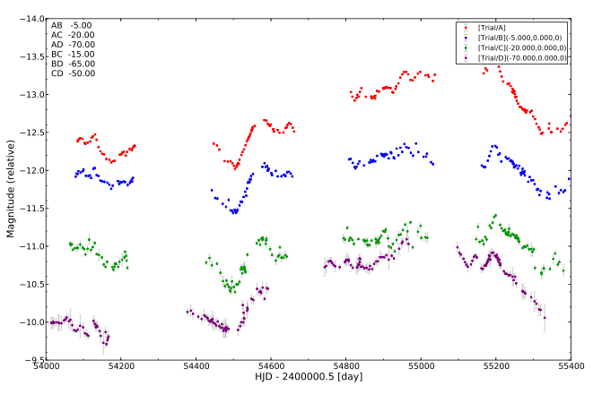

Demonstration scripts
=====================

The scripts and the data
------------------------

The demonstration scripts are found in the directory ``PyCS/demo/demo1``. The "trial curves" from our paper, that is a set of 4-season-long curves of a quad lens shown below, are used/provided in this same demo.

Once PyCS is installed, you can read and execute the scripts in the order given by their names. This will reproduce our results and plots concerning theses trial curves.

Keep in mind that PyCS is written in form of a python package (instead of a procedural program) to be *flexible*. These demo scripts serve only as an illustration of the most basic functions, and what they can be used for.

