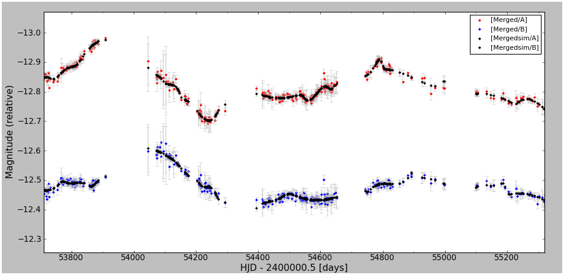
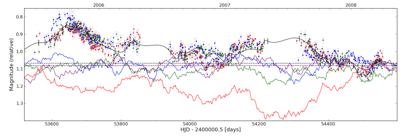
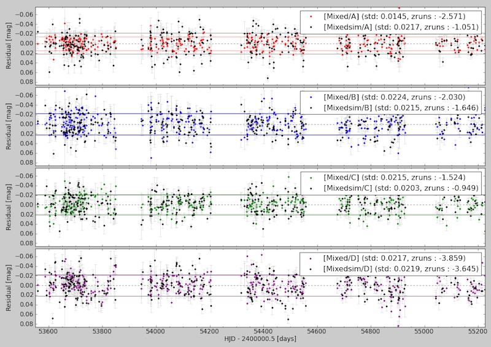
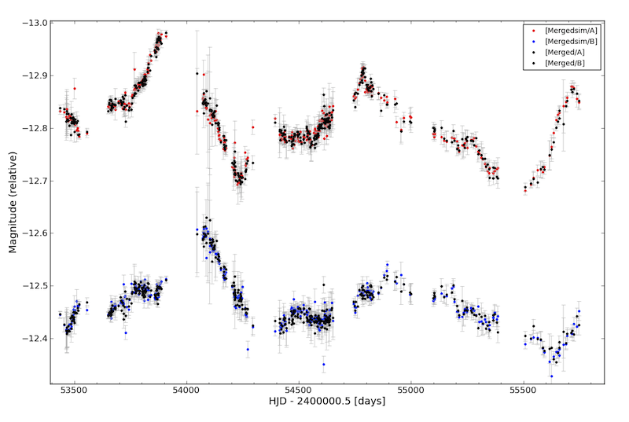

Drawing mock curves
===================

The splines introduced in the previous section are used to draw simulated curves with known time delays. These mock curves can be made very similar to the real observations.

At the bottom of this page a single function to build an entire population of simulated curves is presented. This will be extensively used to empirically evaluate the accuracy of curve shifting methods. But before looking at this wrapper, we have to introduce the details of how these curves are drawn, step by step. 

Drawing individual curves
-------------------------

The idea is the following : you provide some real light curves, and a spline usually obtained from a spline optimizer. Your curves might have some (optimized) microlensing representations, and they will typically be shifted so to match to the spline (i.e., your curves have some well defined time/mag/flux shifts set).

The functions of the module :py:mod:`pycs.sim.draw` will use your curves' time/mag/flux shifts, as well as their sampling, errorbars, and microlensing, to draw mock curves *from the spline you give them*. This means that if we would **not** add noise to these mock curves, they would *perfectly match to the spline*, given all the shifts that your real curves had.

Here comes an example. The function to "manually" draw some mock curves has the funny name :py:func:`pycs.sim.draw.draw`. It takes a list of light curves as well as a spline as input, and returns a corresponding list of mock curves. To use this option, and for practical reasons that will become clear later, we need to "save" the residuals (:py:func:`pycs.sim.draw.saveresiduals`) of your lcs before drawing the mock curves.

::
	
	(lcs, spline) = pycs.gen.util.readpickle("optspl.pkl")
	# Some lightcurves, and a spline to play with.
	
	pycs.sim.draw.saveresiduals(lcs, spline)
	mocklcs = pycs.sim.draw.draw(lcs, spline, shotnoise=None)
	# We draw our first mock curves, here without adding any noise !
		
	pycs.gen.lc.display(mocklcs, [spline])
	# As you see, by default those mocklcs "come with" the same shifts and microlensing as your lcs.

	# Let's manually remove these shifts from all our curves :
	for l in mocklcs:
		l.resetshifts() # also removes microlensing
		l.plotcolour = "black"
	for l in lcs:
		l.resetshifts()
	
	# And overplot the orignial and mock curves :
	pycs.gen.lc.display(lcs + mocklcs, showdelays=False)

.. note:: The mock curves just created are brand new independent :py:class:`pycs.gen.lc.lightcurve` objects. Everything you did so far with lightcurve objects applies also to these mock curves.

The last plot looks like this (the black points are the mock curves, as expected without noise in this case) :

Adding some noise
-----------------

Of course, for about any purpose, we want our mock curves to be noisy. The first trivial way to do this is to add some random "white" (i.e., independent) noise to each magnitude measurement.
This could be done by drawing random gaussian errors according to the errorbars of each point (option shotnoise="magerrs" below), or, to avoid explicitly using the errorbars, we could use the actual observed mismatch between your shifted lcs and the spline, which are the residuals we saved just before.

::
	
	(lcs, spline) = pycs.gen.util.readpickle("optspl.pkl")
	
	# So these lightcurves match to the spline
	pycs.sim.draw.saveresiduals(lcs, spline)

	mocklcs = pycs.sim.draw.draw(lcs, spline, shotnoise="mcres")
	# "mcres" adds some random gaussian noise to the mock curves,
	# using gaussian distributions whose sigma are the previously saved residuals.
	
	pycs.gen.lc.display(mocklcs, [spline])

These new mock curves will now already look rather similar to your observed data.

But the whole point is that we *know* the "true" delays of these mock curves. In fact, the mock curves have an extra "secret" attribute (no need to remember, later functions will do all the calculations for you) :

::

	for l in mocklcs:
		print l.truetimeshift

... that stores what shifts where used to obtain those curves, and hence what the true delays between them are.

Choosing your own shifts
------------------------

Simply shift the curves (or modify their microlensing) *before* calling :py:func:`pycs.sim.draw.draw` (but after having saved the residuals if you want to use them (``shotnoise = mcres`` or ``res``), otherwise these residuals will be crap or course, as the curves won't match to the spline anymore).

Randomizing the microlensing
----------------------------

The aim here is to randomly add some "fast" extrinsic variability ontop of the existing microlensing splines.

For illustration purposes, let's start by doing this manually with the high level function :py:func:`pycs.sim.twk.tweakml`. It takes as argument some lightcurve objects, and adds power-law "noise" to their microlensing, using under the hood the algorithm by Timmer and Koening 1995.
For this to work, the lightcurve objects must have spline microlensing (otherwise they simply won't be tweaked)
Once the function has run on them, they will still have spline microlensing objects, but with many many knots. So these microlensing objects are not meant to be be optimized -- they are just meant to be used as models to draw light curves from ! Of course you can display these lightcurves with tweaked ML.

To illustrate this, we can just tweak the ML of the "observed" data::

	(lcs, spline) = pycs.gen.util.readpickle("optspl.pkl")
	
	# I assume here that at least one of your lcs has some spline ML.
	
	pycs.sim.twk.tweakml(lcs, beta=-2.0, sigma=0.05, fmin=1/500.0)

	# And plot this, to see the tweaked ML :
	pycs.gen.lc.display(lcs)
	

.. note:: In fact, the microlensing curves are noisier on small scales then suggested by the above image, but the dipslay function does not sample the microlensing objects finely enough. This is especially true if you interactively zoom in.

You can experiment a little with different beta, sigma, fmin, fmax, that control the power law noise that will be added to the microlensing.
Also you can try setting the option psplot=True of tweakml, it will show you power spectra.

``beta = -2.0`` corresponds to a random walk !

As you guess, you could use :py:func:`pycs.sim.draw.draw` to draw light curves from these tweaked ones.

 
So this was a nice example to get the idea, but in fact, you don't want to tweak the ML of your lcs *once*, but you want to draw mock curves with always newly tweaked ML.

That's why instead of explicitly calling your mytweakml function, we will just pass this function as an argument to :py:func:`pycs.sim.draw.draw`, and the latter will take care of tweaking the ML itself.

Here is a (new) example :

::
	
	(lcs, spline) = pycs.gen.util.readpickle("optspl.pkl")
	
	# Maybe you need to add some spline ML to curves that don't have it yet :
	pycs.gen.splml.addtolc(lcs[0])
	
	# We define our own tweakml function (you can also do this in myopt.py ...)
	def mytweakml(lcs):
		return pycs.sim.twk.tweakml(lcs, beta=-2.0, sigma=0.05, fmin=1/500.0, fmax=None, psplot=False)

	# And directly draw mock curves :
	mocklcs = pycs.sim.draw.draw(lcs, spline, shotnoise="none", tweakml = mytweakml)

	pycs.gen.lc.display(mocklcs, [spline])
	
	# These mocklcs are drawn without any "shotnoise", all the noise comes from tweakml.

.. note:: Instead of providing a single "mytweakml" function to draw, you can also provide a *list* of mytweakml-like functions, each item of this list corresponding to a light curve in your lcs. This way you can individually adapt the tweakml to the noise properties in each curve.
	Same is true for :py:func:`pycs.sim.draw.multidraw` described below !
	
	::
		
		# Define different tweakml functions, and then (example) : 
		mocklcs = pycs.sim.draw.draw(lcs, spline, tweakml=[Atweakml, othertweakml, othertweakml, othertweakml], shotnoise="none")

		

To generate adequate simulations, we now want to adjust tweakml (and shotnoise) so to get the same kind of residuals between the spline and the real lcs and between the spline and the mocklcs.
We compute those residuals in the next section.

Checking spline residuals
-------------------------

Here are some functions to take a curve, take a spline, "subtract" the spline from the curve, and analyse/look at the scatter of the residuals :

* :py:func:`pycs.gen.stat.subtract`
* :py:func:`pycs.gen.stat.mapresistats`
* :py:func:`pycs.gen.stat.plotresiduals`

Here is how to get a plot of the residuals :

::
	
	(lcs, spline) = pycs.gen.util.readpickle("optspl.pkl")
	
	rls = pycs.gen.stat.subtract(lcs, spline) # This simply subtracts the spline from the datapoints.
	# rls is a list of new lightcurve objects, corresponding to "lcs - spline".
	# You could display it as usual.
	
	# Stats about the residuals :
	print pycs.gen.stat.mapresistats(rls)
	
	# A special function to plot residuals :
	pycs.gen.stat.plotresiduals([rls])

Putting this together with some mocklcs:

::
	
	pycs.gen.splml.addtolc(lcs[1]) # So that all curves have some SplineML !

	def mytweakml(lcs):
		return pycs.sim.twk.tweakml(lcs, beta=-0.5, sigma=1.5, fmin=1/500.0, fmax=None, psplot=False)
	
	mocklcs = pycs.sim.draw.draw(lcs, spline, tweakml=mytweakml, shotnoise="none", keeptweakedml=False)
	
	for l in mocklcs:
		l.plotcolour = "black"
	
	rmocklcs = pycs.gen.stat.subtract(mocklcs, spline) # Same as for the real data.
	# Note that it would be better to fit a new spline to the mocklcs, using the old one is a shortcut ...

	pycs.gen.stat.plotresiduals([rlcs, rmocklcs])
	# Yes, this function takes lists of corresponding lightcurve-lists, exactly for this purpose.

The resulting plot (coloured points are the real curve, black points are a mock curves) :

	

Building sets of mock curves
----------------------------

This is done with one single function, the topmost wrapper, called :py:func:`pycs.sim.draw.multidraw`. It uses :py:func:`pycs.sim.draw.draw`, and stores the drawn curves in pickle files. The same function is also used to simply make a set that contains plain copies of your original curves (I agree, this seems stupid, but hey its flexible).

.. note:: In any case, the curves returned by :py:func:`pycs.sim.draw.multidraw` are **raw observations** : they have no shifts, no ML. Just datapoints !

These mock curves will later be analysed by :py:func:`pycs.sim.run.multirun`.

.. note:: The files I save are just pickles of lists of "lcs". You are welcome to read such a pickle and display it.
	

Define a function to tweak the ml, as above (for instance in ``myopt.py``) :

::

	tweakml = lambda lcs : pycs.sim.twk.tweakml(lcs, beta=-2.0, sigma=0.03, fmin=1/300.0, fmax=None, psplot=False)

.. warning:: You will probably want to add some spline microlensing to **all** your lcs before callign ``multidraw`` or ``draw``, as they will tweak the microlensing only of those curves that have microlensing !

::
	
	(lcs, spline) = pycs.gen.util.readpickle("optspl.pkl")
	pycs.sim.draw.saveresiduals(lcs, spline)
	
	pycs.gen.splml.addtolc(lcs[0]) # So that all curves have some SplineML !
	
	#pycs.gen.lc.display(lcs, [spline])
	
	#pycs.sim.draw.multidraw(lcs, onlycopy=True, n=20, npkl=10, simset="copies")
	
	#pycs.sim.draw.multidraw(lcs, spline, onlycopy=False, n=20, npkl=30, simset="sim1tsr5", shotnoise="mcres", shotnoisefrac=1.0, truetsr=5.0, tweakml=myopt.tweakml, tweakspl=None)

Displaying some curves drawn with multidraw
-------------------------------------------

Just to show that the structure of those pkl files is very easy

::

	# We read in the original data, to overplot :
	lcs = pycs.gen.util.readpickle("merged.pkl")
	for l in lcs:
		l.resetshifts()
		l.plotcolour = "black"
	
	# Reading in a random pickle file :
	mocklcslist = pycs.gen.util.readpickle("sims_sim1tsr5/2_1334738572.78151.pkl")
	pycs.gen.lc.display(mocklcslist[0] + lcs, showdelays=False)

