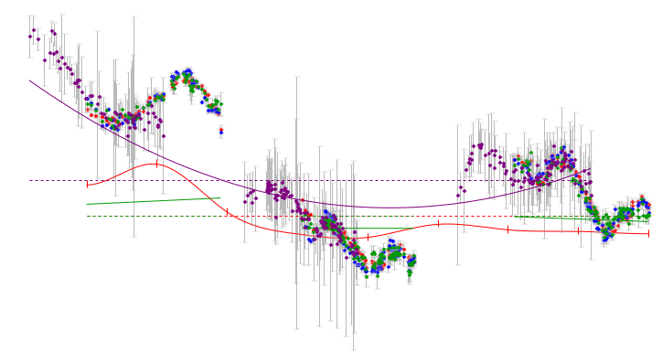

First steps with microlensing
=============================

PyCS offers two families of microlensing representations : polynoms, and splines. Ok of course splines are piecewise polynoms as well, but we mean free-knot splines that are flexible and stable enough to cover decade long curves.

Physically, a microlensing representation can only be "relative", i.e., represent the mismatch *between* curves. Indeed we do not have access to the absolute microlensing magnification that affects each QSO image.

Nevertheless, in ``pycs`` a microlensing representation is "attached" to a lightcurve, as if it would be absolute. This allows you to control individually for each curve what kind of "flexibility" you want to allow.
If you analyse a quad, you might attach such microlensings to 3 of the 4 curves. This would mean that the microlensings are relative with respect to the curve without microlensing. But you can as well put microlensing on all 4 curves. The microlensing representations will then be degenerate, but this will not prevent you from getting the right delays.

Adding ML to your lightcurve
----------------------------

Before running any optimization, you will have to choose and add (aka "attach") the microlensing representation you want for each curve.

Two very easy functions let you add microlensing to a curve with one single line :py:func:`pycs.gen.splml.addtolc` (splines) and :py:func:`pycs.gen.polyml.addtolc` (polynoms): 
::
		
	# Adding a spline, with one knot every 200 days (initial position) :	
	pycs.gen.splml.addtolc(l, knotstep=200)
	
	# Or, if you prefer polynoms, this adds a straight line to each season of l :
	pycs.gen.polyml.addtolc(l, nparams=2)
	
	# The latter function "automatically" recognizes seasons. But with this same function,
	# you can also add one single polynom over your full multi-season curve.
	# To do this, simply increase the autoseasongap.
	pycs.gen.polyml.addtolc(l, nparams=3, autoseasonsgap=1000.0)
	# So this would be a parabola over all seasons.
	
	
Note that microlensing can also be configured without these functions, "by hand", if you have special wishes.
This was just the easy and automatic way.

So now that the microlensing is attached, it will be represented on the plots by continuos coloured lines.

::
	
	pycs.gen.lc.display([l])
	
	
As you see, the microlensig is there, but completely "flat". Its initial coefficients are set so to not affect the curve.
	

Fun with ML
-----------

Mix it !

